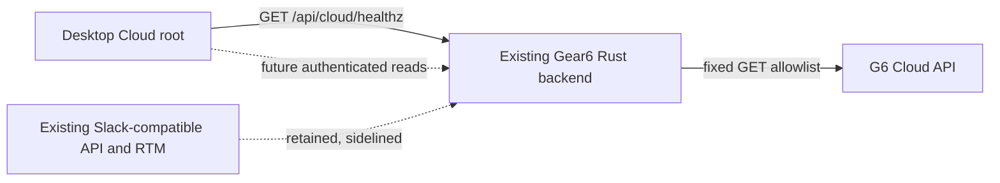

# Desktop-to-Backend-to-G6 Cloud LLD

## Architecture

The desktop webview communicates only with the existing Gear6 Rust backend. The
Rust backend becomes a deliberately narrow Cloud gateway for a fixed allowlist
of G6 Cloud read endpoints. It performs all outbound Cloud requests; the
desktop never receives a Cloud base URL and never calls G6 Cloud directly.



The current backend remains deployed and runnable. Its existing
Slack-compatible `/api/*` endpoints, auth, SQLite state, and RTM implementation
are neither deleted nor repurposed. The new Cloud gateway is isolated under
`/api/cloud` and does not alter existing behavior.

## Backend gateway

### Configuration and lifecycle

- Add a backend-only `GEAR6_CLOUD_BASE_URL` configuration value.
  - It is read solely by Rust at startup and is never exposed as `VITE_*`.
  - It must be an absolute `http` or `https` URL, normalized to a trailing
    slash.
  - Reject credentials, query strings, fragments, and unsupported schemes at
    startup.
  - Missing configuration must not prevent the existing backend from starting;
    it makes only the Cloud gateway unavailable.
- Add a single shared `reqwest::Client` to `AppState`.
  - Connect timeout: 3 seconds.
  - End-to-end request timeout: 12 seconds, allowing Cloud's default 10-second
    server timeout to return first.
  - Redirect policy: disabled. A Cloud redirect is returned as a gateway
    failure rather than followed to an arbitrary origin.
  - TLS verification remains enabled.
- Add a `cloud` backend module containing the configuration parser, fixed
  outbound client, response/error mapping, and handlers. Do not add a generic
  proxy route, dynamic upstream URL input, route-map DSL, or Tauri-side proxy.

### Public route surface

Expose only explicit, read-only routes:

| Desktop route | Cloud upstream | Auth | Current use |
| --- | --- | --- | --- |
| `GET /api/cloud/healthz` | `GET /healthz` | No | Cloud root readiness |
| `GET /api/cloud/v1/open-decisions` | `GET /v1/open-decisions` | Existing backend auth | Future UI |
| `GET /api/cloud/v1/open-constraints` | `GET /v1/open-constraints` | Existing backend auth | Future UI |

- The list routes forward only the allowlisted `entity_id`, `limit`, and
  `cursor` query parameters.
- The backend preserves opaque cursors verbatim. It does not decode, store,
  alter, or generate them.
- Do not expose `/v1/actions` or `/v1/overview` yet. Both require
  `X-G6-Actor-ID`, and no valid source of that Slack ID exists until the planned
  user-directory and user-switching API is available.
- Do not forward inbound `Authorization`, cookies, arbitrary headers, request
  bodies, or desktop-supplied actor IDs to Cloud.
- Do not add mutations, acknowledgements, polling, WebSocket forwarding,
  retries, or caching. Cloud remains a read-only recommendation source.

### Response and error contract

`/api/cloud` is intentionally not Slack-shaped. It preserves Cloud-style status
semantics instead of returning HTTP 200 with `{ ok: false }`.

- Successful Cloud JSON responses are relayed as `application/json` with their
  original `200` body.
- `/api/cloud/healthz` relays Cloud's plain-text `200` or `503` readiness
  response.
- Cloud `400` and `503` JSON error envelopes are relayed without changing
  `error.code` or `error.message`.
- Cloud `504` remains a bodyless `504`.
- Local gateway failures use this bounded JSON envelope:

```json
{
  "error": {
    "code": "cloud_not_configured | cloud_unreachable | cloud_timeout | cloud_redirect | cloud_invalid_response",
    "message": "safe human-readable message"
  }
}
```

- Map missing `GEAR6_CLOUD_BASE_URL` to `503 cloud_not_configured`.
- Map connection, DNS, or TLS failure to `502 cloud_unreachable`.
- Map either backend request deadline or a Cloud `504` to `504`; only the
  former returns `cloud_timeout`.
- Reject upstream redirects with `502 cloud_redirect`.
- Reject non-JSON list responses, malformed JSON, and unexpected content types
  with `502 cloud_invalid_response`.
- Log upstream failure category, status, and route locally, but never log Cloud
  response bodies, backend authorization tokens, or future actor identities.

### Backend security and CORS

- Keep the existing single-origin backend CORS policy. The desktop now calls
  only the existing backend origin, so Cloud itself requires no browser CORS
  configuration.
- Preserve the current backend's `Authorization` and `Content-Type` CORS
  allowlist; do not add `X-G6-Actor-ID` because the browser never sends it.
- Keep the health route unauthenticated because it reveals only service
  readiness and allows the deferred Cloud root to boot before local user
  authentication exists.
- Require the existing `Auth` extractor for future Cloud list routes. In
  `GEAR6_DISABLE_AUTH` development, they continue to resolve to the existing
  `dev` user.
- Cap proxied response bodies at 1 MiB before returning them to the webview. A
  response exceeding the cap returns `502 cloud_invalid_response`.

## Desktop changes

### Runtime modes

Replace the single-purpose `VITE_GEAR6` switch with an explicit app-surface
mode:

- `VITE_G6_APP_MODE=cloud`: new default for Tauri development and packaged
  builds. Mounts the new Cloud root and communicates only with `/api/cloud/*`.
- `VITE_G6_APP_MODE=local`: preserves the current `Gear6Root`,
  Slack-compatible HTTP adapter, and RTM behavior.
- `VITE_G6_APP_MODE=legacy`: preserves the existing Nostr/Tauri app shell.
- Treat the existing `VITE_GEAR6=1` as a temporary compatibility alias for
  `local`.

Update Tauri's development and build commands to set `VITE_G6_APP_MODE=cloud`.
Update frontend documentation with exact commands for `cloud`, `local`, and
`legacy` modes.

### Cloud root and UI scope

Add a dedicated Cloud root rather than reusing the current `Gear6Root`, which
depends on the sidelined backend's `users.identity` endpoint.

- On startup, the Cloud root calls only `GET /api/cloud/healthz`.
- Render:
  - Connecting state.
  - Ready state: "Gear6 Cloud is ready."
  - Configuration, unavailable, timeout, and invalid-response states with
    concise diagnostic copy.
  - Manual Retry, which starts one fresh readiness request.
- Do not render actions, overview counts, decisions, constraints, user
  selection, channels, messages, or the legacy application shell in this
  release.
- Do not initialize `rtm.connect()` in Cloud mode. It remains active only in
  `local` mode.
- Keep the existing compact, always-on-top Tauri window behavior unchanged.

### Desktop API boundary

Add a small `shared/api/cloudGateway/` client for the backend-facing Cloud
namespace.

- The client derives its origin only from the existing backend configuration
  (`VITE_RELAY_URL` to HTTP origin), never from a Cloud URL.
- Expose typed methods for `health`, `listOpenDecisions`, and
  `listOpenConstraints`.
- Model the Cloud response types directly: `Page`, `Entity`, `Signal`,
  `SignalListResponse`, and the error envelope.
- Preserve dates, ages, confidence values, signal IDs, and cursors exactly as
  received.
- Do not route Cloud responses through the legacy `invoke.ts`, relay-event
  adapter, or RTM client.
- Keep the API boundary narrow enough that a future gateway needs only a
  backend configuration change, not frontend feature changes.

## Future router and user integration

The later router is a backend deployment concern, not a desktop concern.

- The future router must be an HTTP-compatible reverse proxy or BFF upstream of
  `GEAR6_CLOUD_BASE_URL`.
- It must preserve the allowlisted Cloud paths, methods, query parameters,
  response status codes, content types, and error envelopes.
- Switching from direct backend-to-Cloud to backend-to-router changes only
  `GEAR6_CLOUD_BASE_URL`.
- Do not make the desktop follow redirects, resolve remote routing
  configuration, or learn alternate upstream URLs.
- When the user API arrives:
  - Add a backend-owned mapping from authenticated Gear6 user to Cloud Slack
    account ID.
  - Add selected-user state and switching UI separately.
  - Only then add backend routes for `/api/cloud/v1/actions` and
    `/api/cloud/v1/overview`.
  - The backend, not the desktop, injects the validated `X-G6-Actor-ID`
    upstream.

## Verification

- Backend unit tests:
  - Cloud URL validation and normalization.
  - Missing configuration leaves existing backend routes healthy.
  - Fixed route allowlist rejects any unimplemented path.
  - Query forwarding preserves valid opaque cursors and excludes unrecognized
    parameters.
  - No inbound authorization, cookies, actor headers, or request body are
    forwarded.
  - Upstream status/error mapping for `200`, `400`, `503`, `504`, network
    failure, timeout, redirect, malformed response, and oversized body.
- Backend integration tests with a local mock upstream:
  - `healthz` plain-text pass-through.
  - Cloud list JSON pass-through and exact query/header assertions.
  - Existing Slack `/api/*`, auth, and `/rtm` tests remain unchanged and pass.
- Frontend unit tests:
  - Mode selection and `VITE_GEAR6=1` compatibility.
  - Cloud root loading, ready, every error state, and retry recovery.
  - Cloud mode never imports or starts RTM, the local adapter, or the legacy app
    shell.
  - Cloud gateway client uses only the backend origin and never contains
    `GEAR6_CLOUD_BASE_URL`.
- Desktop smoke tests:
  - Cloud-mode Tauri app reaches a local G6 Cloud instance through the Rust
    backend.
  - Stopping Cloud produces the recoverable unavailable state.
  - `local` mode still boots against the current backend.
  - Browser network inspection confirms there are no direct requests from the
    webview to the Cloud origin.

## Assumptions

- [`g6.cloud/openapi.yaml`](../../g6.cloud/openapi.yaml) is authoritative and
  its API remains read-only.
- The Cloud repository remains unchanged for this work; only its configured
  upstream URL is consumed by the existing Gear6 backend.
- The user-directory and selected-user API are deferred, so actor-scoped Cloud
  endpoints are intentionally unavailable.
- Existing local-backend functionality is retained but sidelined behind
  explicit `local` mode.
