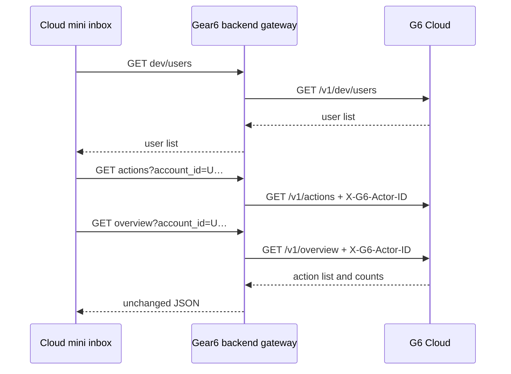

# Cloud User Selection LLD

## Objective

Enable the compact Cloud window to render the action inbox for a user selected during local development. The browser continues to communicate only with the Gear6 backend; it never learns or calls the G6 Cloud origin.

## Route contract

| Desktop route | Cloud route | Input | Availability |
| --- | --- | --- | --- |
| `GET /api/cloud/v1/dev/users` | `GET /v1/dev/users` | none | development only |
| `GET /api/cloud/v1/actions?account_id={id}` | `GET /v1/actions` | selected Cloud account | development only |
| `GET /api/cloud/v1/overview?account_id={id}` | `GET /v1/overview` | selected Cloud account | development only |

- The Gear6 gateway validates `account_id` as a non-empty value of at most 128 bytes that can be represented in an HTTP header.
- For action and overview reads, the gateway injects `X-G6-Actor-ID: {account_id}` into its own upstream request. The browser never sends that header.
- The development routes are compiled out of release builds, matching the Cloud API's release behavior. Requests then receive 404.
- Existing health, open-decision, and open-constraint routes retain their current contracts.

## Backend design

1. Extend `src/cloud.rs` with three fixed upstream path constants and explicit Axum routes. Do not create a generic proxy or caller-selected upstream path.
2. Add `ActorQuery { account_id }` and a single validation helper that returns `400 invalid_actor` for missing, empty, oversized, or invalid header input.
3. Refactor the outbound send helper to accept an optional gateway-owned actor header. All existing routes call it with no actor; actions and overview call it with the validated value.
4. Reuse the current JSON pass-through behavior for development users, actions, and overview: accepted statuses are 200, 400, and 503; Cloud 504 remains bodyless; malformed, oversized, redirected, and unexpected responses keep current gateway errors.
5. Keep the existing backend authentication extractor on every non-health Cloud read. Development runs continue to use the established development-auth behavior.

## Data flow

## Security invariants

- `GEAR6_CLOUD_BASE_URL` remains backend-only.
- No inbound cookies, authorization, arbitrary headers, request body, or browser-provided actor header reach Cloud.
- Only the selected account query value becomes the specific actor header after backend validation.
- No development directory code or route exists in a release Gear6 backend.
- Cloud response bodies are never added to backend logs.

## Verification

- Unit-test account validation and the development/release route surface.
- Integration-test exact upstream paths, actor-header injection, absence of authorization/cookies, and invalid-account rejection with a local mock Cloud server.
- Retain tests for timeout, redirect, response-size, JSON, and Cloud-error pass-through behavior.

